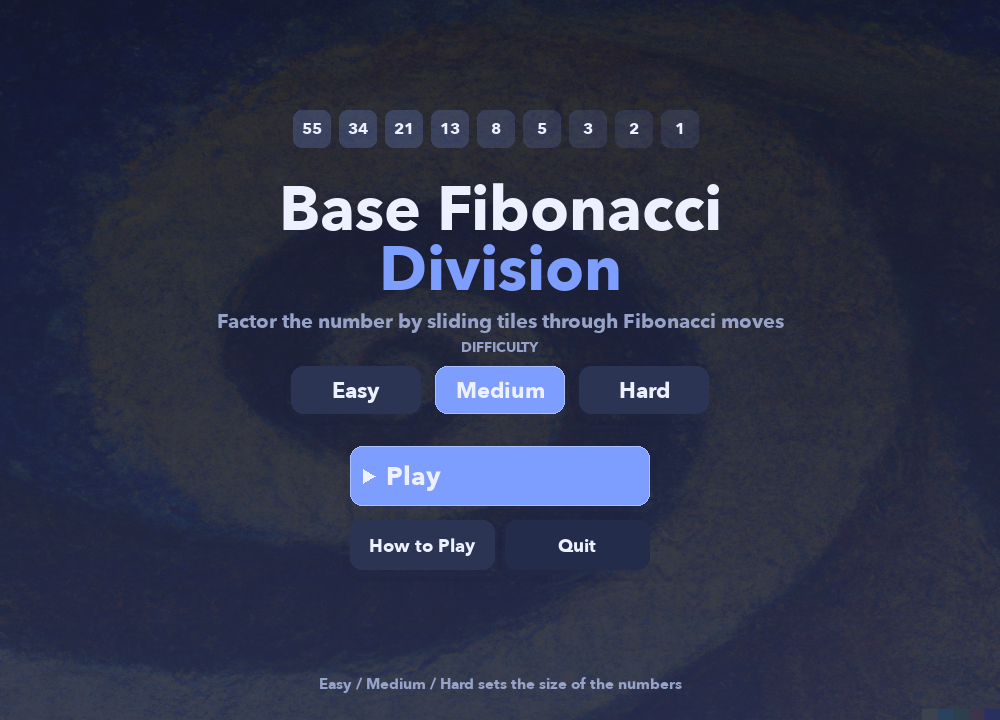
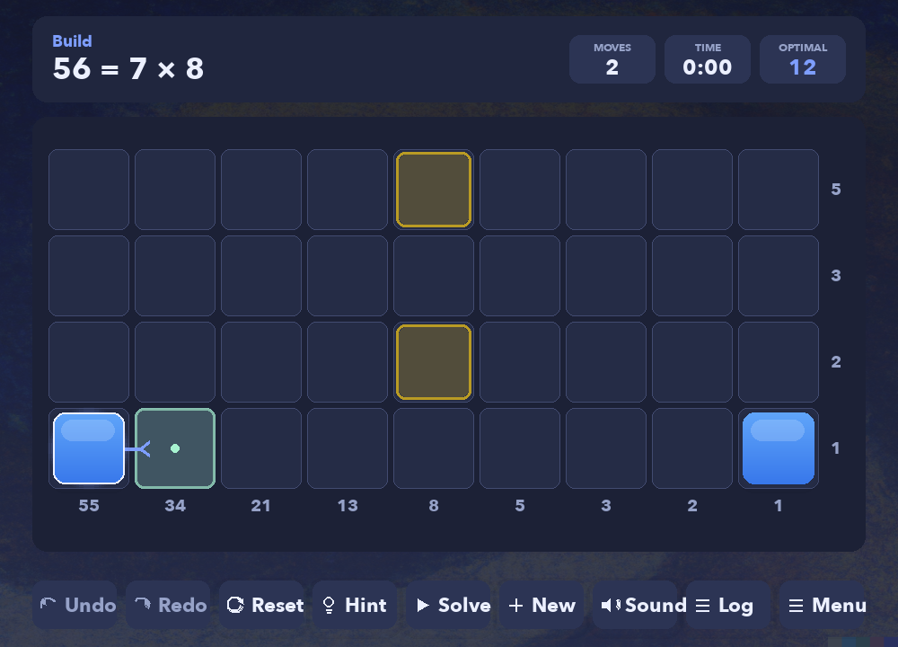
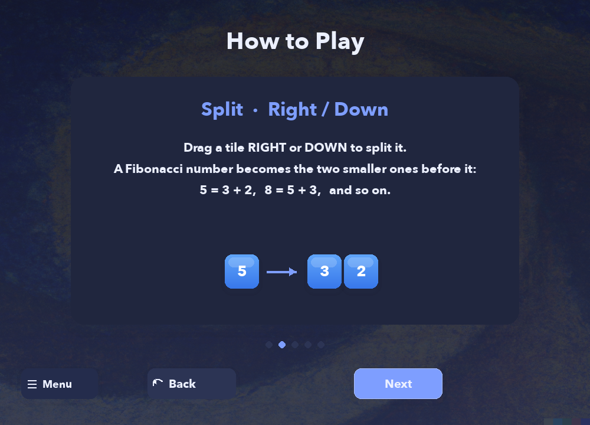
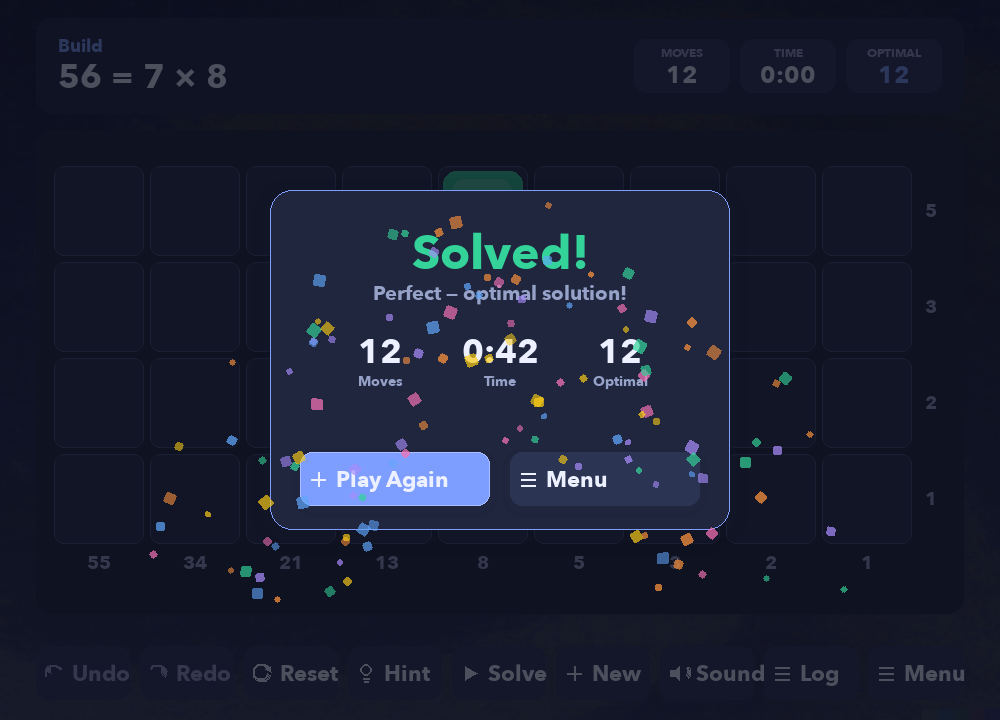

<div align="center">

# 🌀 Base Fibonacci Division

### A puzzle game about dividing numbers in base Fibonacci

Factor a number by sliding tiles through Fibonacci identities until the board
reveals its hidden factorization. Built with **pygame** — plays on the
**desktop** and in the **browser**.



</div>

---

## 📖 Table of contents

- [What is this game?](#-what-is-this-game)
- [How to play](#-how-to-play)
- [The four moves](#-the-four-moves)
- [Features](#-features)
- [Install & run (desktop)](#-install--run-desktop)
- [Play in the browser (web build)](#-play-in-the-browser-web-build)
- [Controls](#-controls)
- [How it works (the math)](#-how-it-works-the-math)
- [Project layout](#-project-layout)
- [Development & tests](#-development--tests)

---

## 🎯 What is this game?

Every puzzle is a division problem in disguise: **N = divisor × quotient**
(for example `56 = 7 × 8`).

The number **N** starts spread across the **bottom row** as a set of
[Zeckendorf](https://en.wikipedia.org/wiki/Zeckendorf%27s_theorem) (base-Fibonacci)
tiles. Each **glowing gold slot** marks where a tile needs to end up. Your job is
to slide and reshape the tiles — without ever changing their total value — until
**every gold slot holds exactly one tile** and nothing is left over. That final
arrangement _is_ the factorization.

<div align="center">

</div>

---

## 🕹 How to play

1. **Pick a difficulty** on the title screen (it sets how big the numbers get).
2. **Click a tile.** Its legal destinations light up in **mint**.
3. **Drag it** onto a highlighted neighbour to split or merge.
4. Keep going until each **gold target slot** holds a single tile.
   Correctly-placed tiles turn **green**.
5. Stuck? Tap **Hint** for the next best move, or **Solve** to watch the optimal
   solution play out.

New to it? The in-game **How to Play** walkthrough explains everything visually:

<div align="center">

</div>

---

## 🔁 The four moves

Tile labels are Fibonacci numbers that grow toward the top-left, so neighbouring
labels always satisfy `Fₙ = Fₙ₋₁ + Fₙ₋₂`. Every move keeps the board's total value
identical — you're only ever rewriting one Fibonacci identity:

| Move      | Direction                       | Effect                                                     |
| --------- | ------------------------------- | ---------------------------------------------------------- |
| **Split** | drag **→ / ↓**                  | one tile becomes its two smaller neighbours — `5 → 3 + 2`  |
| **Merge** | drag **← / ↑**                  | two consecutive tiles fuse into the next one — `3 + 2 → 5` |
| **Carry** | at the last column / bottom row | two unit tiles combine — `1 + 1 → 2`                       |

---

## ✨ Features

- 🎨 **Polished, animated UI** — gradient tiles, soft shadows, pop animations,
  glowing target slots, and a celebratory confetti win screen.
- 💡 **Smart help** — an optimal **BFS solver** powers the **Hint** button and the
  animated **Solve** playback, and shows you the **optimal move count** to beat.
- ↩️ **Undo / Redo / Reset** — experiment freely; every move is reversible.
- 🟢 **Valid-move highlighting** — click any tile to instantly see where it can go.
- 📜 **Collapsible move log** and a live **moves / time / best** HUD.
- 🎚 **Difficulty levels** that scale the size of the numbers (and the board).
- 🔊 **Sound effects** with a mute toggle.
- 🌐 **Runs on desktop and in the browser** from a single codebase.

---

## 💻 Install & run (desktop)

> Requires **Python 3.9+**.

```bash
# 1. clone, then from the project folder:
python -m venv .venv
source .venv/bin/activate          # Windows: .venv\Scripts\activate

# 2. install dependencies
pip install -r requirements.txt

# 3. play!
python main.py
```

That's it — `python main.py` opens the game window.

<details>
<summary>Prefer conda?</summary>

```bash
conda create --name fibgame python=3.10 -y
conda activate fibgame
pip install -r requirements.txt
python main.py
```

</details>

---

## 🌐 Play in the browser (web build)

The game compiles to WebAssembly with [pygbag](https://github.com/pygame-web/pygbag),
so it runs in any modern browser with no install.

### Quick start (dev server with live reload)

```bash
pip install pygbag
pygbag main.py              # opens http://localhost:8000
```

### Static build (for hosting or local testing)

```bash
pygbag --build main.py      # outputs build/web/
```

Then either upload `build/web/` to any static host, or serve locally:

```bash
python -m http.server 8000 --directory build/web
```

---

## ⌨️ Controls

| Input                   | Action                                                        |
| ----------------------- | ------------------------------------------------------------- |
| **Click + drag** a tile | move it (split / merge)                                       |
| **Click** a tile        | highlight its legal moves                                     |
| `U`                     | Undo · `R` Redo                                               |
| `H`                     | Hint · `N` New puzzle                                         |
| `Esc`                   | Back to menu                                                  |
| Button bar              | Undo · Redo · Reset · Hint · Solve · New · Sound · Log · Menu |

---

## 🧮 How it works (the math)

Zeckendorf's theorem says every positive integer has a unique representation as a
sum of **non-consecutive Fibonacci numbers** (e.g. `56 = 55 + 1`). The board is a
2-D grid whose rows and columns are labelled with Fibonacci numbers; a tile in the
cell at row-label `Fᵣ` and column-label `F𝒸` is worth `Fᵣ · F𝒸`.

- The **bottom row** (row-label `1`) seeds `N` directly from its Zeckendorf digits.
- The **target slots** are the _outer product_ of the divisor's and quotient's
  Zeckendorf representations — together they sum to `divisor × quotient = N`.
- The four moves are exactly the Fibonacci recurrence (`Fₙ = Fₙ₋₁ + Fₙ₋₂`) and the
  identity `2·Fₙ = Fₙ₊₁ + Fₙ₋₂`, so the **total value is invariant**. Reaching the
  target arrangement is therefore a valid proof that `N = divisor × quotient`.

Reference: _Zeckendorf representations and the MOVES game_
([PDF](http://educ.jmu.edu/~lucassk/Papers/MOVES%20paper%20revised.pdf)).

---

## 🗂 Project layout

```
main.py               # entry point (desktop + web)
zdg/
  rules.py            # the four moves as pure, testable functions (single source of truth)
  grid.py · cell.py   # board model + win detection
  problem.py · util.py# problem generation + Zeckendorf math
  solver.py           # BFS shortest-path solver (hint / solve / optimal count)
  history.py          # undo / redo
  app.py              # async game loop + scene manager (web-safe)
  theme.py · settings.py · sound.py · particles.py
  ui/                 # buttons, board renderer, HUD + move log
  scenes/             # menu · game · tutorial · win overlay
tools/screenshot.py   # renders the README screenshots headlessly
tests/                # unittest: rules, solver, Zeckendorf utils
```

---

## 🧪 Development & tests

```bash
# run the test suite (headless)
SDL_VIDEODRIVER=dummy python -m unittest discover -s tests

# regenerate the README screenshots
SDL_VIDEODRIVER=dummy python tools/screenshot.py
```

The move logic lives in `zdg/rules.py` as pure functions, so both gameplay and the
solver share one definition — a property the tests enforce (every legal move
preserves the board's total value, and every solver path provably reaches a win).

---

<div align="center">



_Solve it in the fewest moves — can you match the optimal?_

</div>
